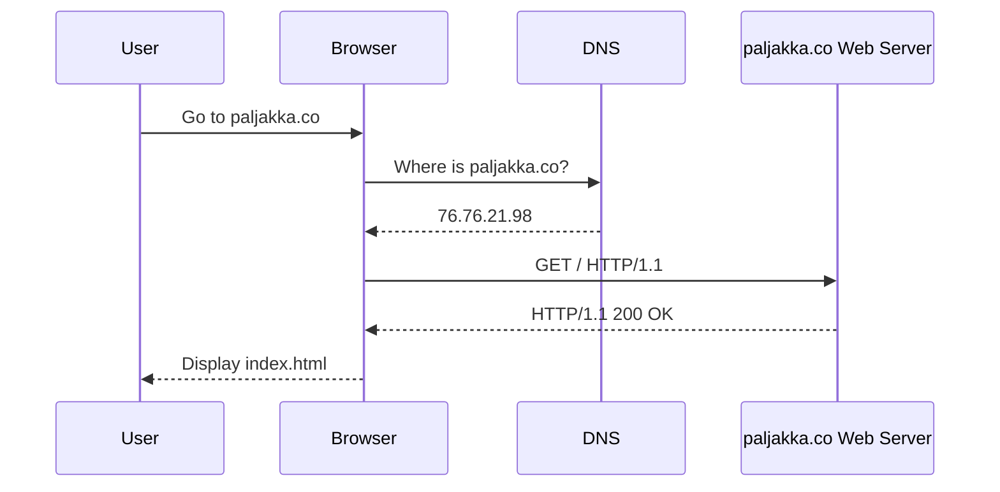
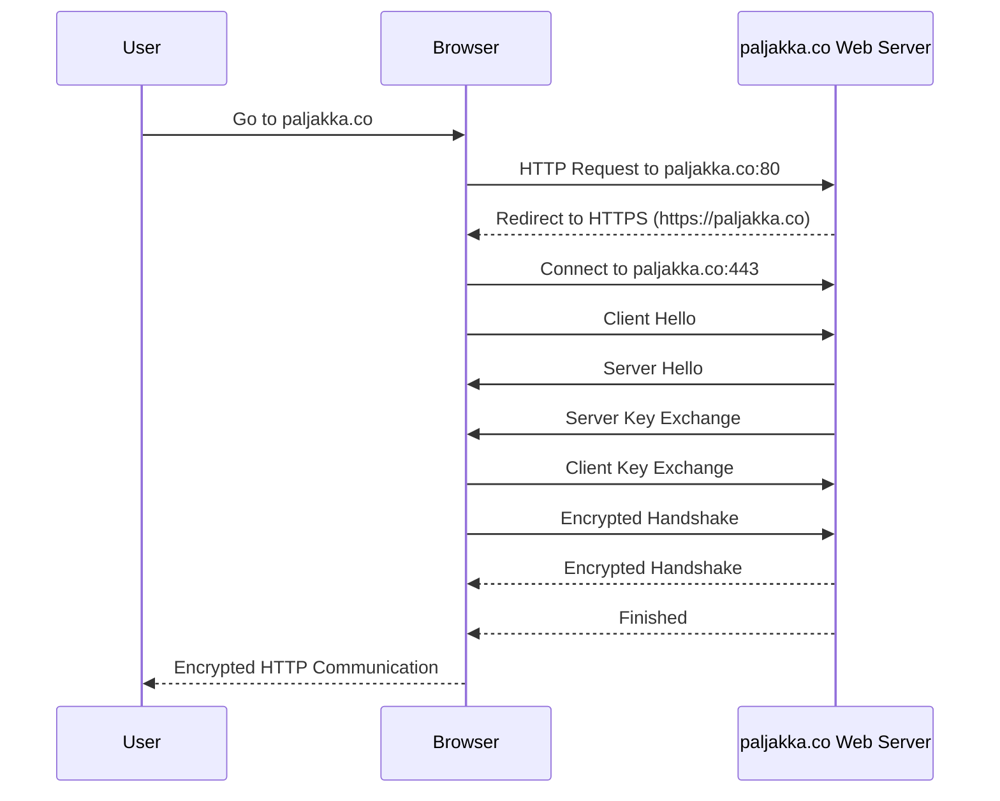

# Day 2: Exploring Web Requests and HTTP Fundamentals

Today's focus is a deep dive into the technicalities of web requests and HTTP, essential tools in the toolkit of cyber security professional.
First courses are very simple and if you have any history of software development or any background related to IT, you'll find them easy
For me, i had already experience in field of software development. But cURL is not something i use daily, however the headers, response codes and request methods are familiar for me
so this was mostly about getting hang of cURL commands

## Achievements of the Day:

- Utilized cURL for in-depth analysis of website headers and requests, enhancing understanding of web communication protocols.
- Successfully captured initial flags using cURL, demonstrating practical application of learned concepts.

## Key Learnings:

Today's session was centered around refining cURL command skills and applying them to extract and analyze data from web sources.

### Few new things about cURL

- Using Basic Authentication: curl -u username:password https://api.example.com/securedata
- Sending Cookies in a Request: curl -b "cookie1=value; cookie2=value" https://example.com
- POST Request with JSON Data: curl -H "Content-Type: application/json" -d '{"key1":"value1", "key2":"value2"}' -X POST https://api.example.com/submit

### HTTP

This is basic example of how web browser is having a conversation with web server without encryption

### HTTPS

This is an basic example of same conversation but with the encryption

### Headers: The Information Carriers

#### **Headers** – encoding the silent dialogues between client and server. 🤫

Headers play a critical role in the exchange of data between client and server. Understanding the types and purposes of different headers is crucial for any IT professional.

### Methods and Response Codes: The Syntax of Web Interaction

Each method and code, a word; each request and response, a sentence in the ongoing narrative of internet communication. 📖

#### The Common Request Methods:

- GET: The seeker of resources.
- POST: The creator of content.
- PUT: The meticulous editor.
- DELETE: The eraser of bytes.
- OPTIONS: The inquirer of communication options.
- HEAD: The silent observer, probing for meta-info.

#### The Responses Codes Decoded:

- 1xx Provides information and does not affect the processing of the request.
- 2xx Returned when a request succeeds.
- 3xx Returned when the server redirects the client.
- 4xx Signifies improper requests from the client. For example, requesting a resource that doesn't exist or requesting a bad format.
- 5xx Returned when there is some problem with the HTTP server itself.
